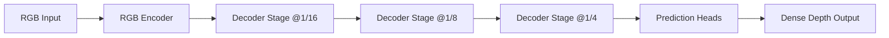
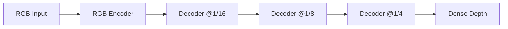
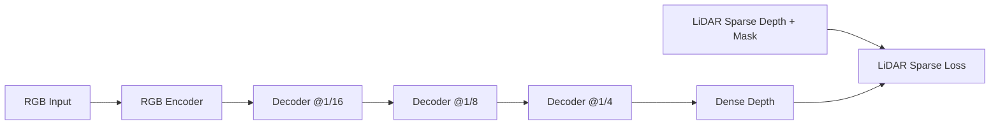
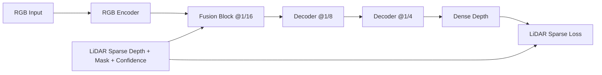
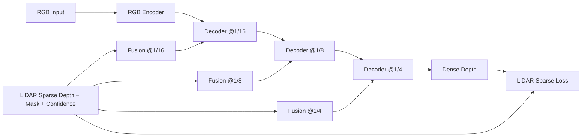

# 0) Foundations for Readers with Basic ML Background

This note is for readers who know basic machine learning but are new to multimodal depth estimation.

---

## 0.1 What problem are we solving?

We want to estimate **depth** (distance from camera to scene points) from an image.

- **RGB-only depth estimation**: use only color image.
- **RGB + LiDAR depth estimation**: use image plus sparse depth measurements from LiDAR.

Why hard?

- A 2D image loses true 3D distance information.
- Many different 3D scenes can look similar in 2D (depth ambiguity).

Intuition: RGB gives rich appearance cues (edges, texture, semantics), while LiDAR gives direct geometric distance at sparse points.

---

## 0.2 What is “fusion” in this context?

**Fusion** means combining information from two modalities (RGB features + LiDAR features) so the model can use both.

### Simple intuition

Think of depth prediction as decision making:

- RGB says: “This region looks like a wall, likely far.”
- LiDAR says: “At these pixels, exact distance is 2.8m.”

Fusion lets the model reconcile both, instead of trusting only one.

### A generic fusion equation

$$
\mathbf{z}_{new} = \mathbf{z}_{rgb} + g \odot (\mathbf{z}_{lidar} - \mathbf{z}_{rgb})
$$

Meaning of terms:

- $\mathbf{z}_{rgb}$: current RGB latent feature.
- $\mathbf{z}_{lidar}$: LiDAR-informed feature.
- $g$: a learned gate (usually values in $[0,1]$).
- $\odot$: element-wise multiplication.

Intuition of gate $g$:

- If $g \approx 0$, keep RGB feature mostly unchanged.
- If $g \approx 1$, move strongly toward LiDAR-informed feature.
- If $0 < g < 1$, blend both.

This is exactly why gated fusion is robust: it can trust LiDAR where LiDAR is reliable and trust RGB where LiDAR is sparse/noisy.

---

## 0.3 What is 1/16 sampling (or 1/16 scale)?

In CNN/Transformer vision pipelines, feature maps are often downsampled.

If input image is $H \times W$, then:

- at **1/2 scale**: $(H/2) \times (W/2)$
- at **1/4 scale**: $(H/4) \times (W/4)$
- at **1/16 scale**: $(H/16) \times (W/16)$

Example for $384 \times 384$ input:

- 1/16 map is $24 \times 24$.

### How downsampling is actually done in our 4 models

In your Phase-5 experiments, all four variants share the same backbone (`convnextv2_large`), so the **RGB downsampling method is identical** across all methods.

#### Step 1: RGB encoder downsampling (same for all 4 methods)

From `model/backbones/convnext2.py`:

1. **Stem conv**: `kernel_size=4, stride=4`
  - Directly maps input to **1/4 scale**.
2. **Downsample layer 1**: `kernel_size=2, stride=2`
  - 1/4 -> **1/8**.
3. **Downsample layer 2**: `kernel_size=2, stride=2`
  - 1/8 -> **1/16**.
4. **Downsample layer 3**: `kernel_size=2, stride=2`
  - 1/16 -> **1/32**.

So for a $384\times384$ image, encoder stages naturally contain features around:

- 1/4: $96\times96$
- 1/8: $48\times48$
- 1/16: $24\times24$
- 1/32: $12\times12$

#### Step 2: Decoder feature alignment uses interpolation

From `model/unidepthv1/decoder.py` and `utils/geometric.py`:

- The decoder first collects multi-stage encoder outputs.
- It then uses `flat_interpolate(...)` (internally `F.interpolate`, bilinear) to resize features to a common resolution for fusion/attention processing.

This means your decoder down/up-scale alignment is done by **bilinear interpolation on feature tensors**, not pooling.

#### Step 3: LiDAR map resizing depends on model variant

- **RGB-only**: no LiDAR branch, so no LiDAR downsampling.
- **Supervision-only**: no LiDAR feature fusion branch; LiDAR is mainly used in sparse loss.
- **Late fusion**: LiDAR map pack is resized with `F.interpolate(..., mode="nearest")` to 1/16 (single fusion scale).
- **Token fusion**: LiDAR map pack is resized with `mode="nearest"` to 1/16, 1/8, and 1/4 (multi-scale fusion).

So the project uses:

- **RGB feature downsampling**: strided convolutions in ConvNeXtV2 encoder.
- **Decoder feature-scale alignment**: bilinear interpolation (`flat_interpolate`).
- **LiDAR spatial resizing for fusion**: nearest-neighbor interpolation.

#### Model-by-model summary (what changes, what does not)

1. **RGB-only**
  - RGB downsampling: ConvNeXtV2 stride-conv pipeline (same as others).
  - LiDAR downsampling: none.

2. **Supervision-only**
  - RGB downsampling: same ConvNeXtV2 pipeline.
  - LiDAR downsampling in feature path: none (because no fusion branch).

3. **Late fusion**
  - RGB downsampling: same ConvNeXtV2 pipeline.
  - LiDAR downsampling: nearest-neighbor resize to 1/16 for one fusion block.

4. **Token fusion**
  - RGB downsampling: same ConvNeXtV2 pipeline.
  - LiDAR downsampling: nearest-neighbor resize to 1/16, 1/8, 1/4 for three fusion points.

### What changes mathematically when resolution shrinks

Let the original feature map be:

$$
\mathbf{X} \in \mathbb{R}^{H \times W \times C}
$$

After downsampling by factor $s$:

$$
\mathbf{X}^{(s)} \in \mathbb{R}^{(H/s) \times (W/s) \times C'}
$$

- Spatial size decreases by $s^2$ times.
- Channel size often increases from $C$ to $C'$ to preserve representational power.

### Token-count intuition (important for Transformers)

If tokens are flattened from spatial grid:

$$
N = H \cdot W, \qquad N_{1/16} = (H/16)(W/16)=\frac{HW}{256}
$$

For $384 \times 384$:

- Full-resolution tokens: $147{,}456$
- 1/16 tokens: $576$

So spatial tokens become 256x fewer.

### Why this matters for compute

In self-attention, complexity is roughly quadratic in token count:

$$
  ext{Cost} \propto N^2
$$

Going from full resolution to 1/16 reduces $N$ dramatically, so attention cost drops by a huge factor. This is a major reason coarse scales are used for global reasoning.

### Why not do everything at 1/16 then?

Because fine boundaries are lost at coarse scale.

- Coarse map is good for global geometry (room layout, large objects).
- Fine map is needed for thin structures, object edges, and local discontinuities.

So practical depth models use **coarse-to-fine decoding**:

1. reason globally at coarse scale,
2. progressively upsample,
3. refine with higher-resolution features.

### Project-specific intuition (how it appears here)

In this project’s decoder design, geometry reasoning starts from coarse latent tokens and is then upsampled step-by-step to finer maps.

- Late fusion injects LiDAR once at coarse scale (around 1/16).
- Token fusion injects LiDAR repeatedly at 1/16, 1/8, 1/4.

This matches the general principle:

- coarse fusion for global alignment,
- finer fusion for detail correction.

### Why use 1/16 features?

1. **Lower compute/memory**: fewer spatial tokens.
2. **More semantic context**: each token “sees” a larger receptive field.
3. **Stable global reasoning**: useful for coarse geometry.

### Trade-off

- Pro: global context and efficiency.
- Con: less fine detail (thin edges, tiny objects).

That is why modern decoders use multi-scale design:

- coarse (1/16) for global structure,
- finer scales (1/8, 1/4, 1/2) for boundary/detail refinement.

---

## 0.4 Late fusion vs Token fusion (intuitive)

### Late fusion

- Fuse LiDAR at one coarse stage (in this project: around 1/16 scale).
- Then continue decoding.

Intuition: LiDAR gives a strong global geometric hint once, early in decoder geometry reasoning.

### Token fusion

- Fuse at multiple scales (1/16, 1/8, 1/4).
- Each scale has its own attention and gate.

Intuition: geometry guidance is injected repeatedly:

- coarse scale helps global layout,
- mid/fine scales help local depth details.

---

## 0.5 How LiDAR works compared to RGB-only method

## RGB-only depth

Input:

- Only image $I \in \mathbb{R}^{H \times W \times 3}$.

Model learns a mapping:

$$
\hat{D} = f_\theta(I)
$$

- $\hat{D}$: predicted dense depth map.
- $f_\theta$: neural network with parameters $\theta$.

Pros:

- no extra sensor required at inference.
- easy deployment.

Cons:

- depth is inferred indirectly from appearance cues.
- ambiguous in textureless/repetitive or unusual lighting scenes.

## RGB + LiDAR method

Additional input (sparse):

- LiDAR depth map $D_L$ (many pixels missing).
- Validity mask $M$ (1 where LiDAR has measurement, 0 otherwise).

Typical sparse supervision term (used in this project’s training loop):

$$
\mathcal{L}_{lidar}
=
\frac{\sum_{p} M_p\,\left|\log \hat{D}_p - \log D_{L,p}\right|}{\sum_{p} M_p + \epsilon}
$$

Meaning:

- $p$: pixel index.
- $M_p$: whether LiDAR depth exists at pixel $p$.
- $\hat{D}_p$: predicted depth at pixel $p$.
- $D_{L,p}$: LiDAR depth at pixel $p$.
- log-space error emphasizes relative consistency across depth ranges.
- $\epsilon$: tiny constant to avoid divide-by-zero.

Intuition:

- RGB tells “shape and semantics everywhere.”
- LiDAR tells “true metric distance at selected anchor points.”
- Fusion + sparse loss encourages model to align global RGB understanding with metric anchors.

---

## 0.6 Why sparse LiDAR can still help dense prediction

Even if LiDAR is sparse, it provides **metric anchors**.

Imagine a large wall region:

- RGB-only may know wall orientation but not absolute distance scale.
- A few LiDAR points can calibrate that scale.

Then the network propagates this information through learned spatial/contextual patterns to predict dense depth.

---

## 0.7 Why supervision-only may be weaker than feature fusion

Two different ways to use LiDAR:

1. **Supervision-only**: LiDAR affects loss, but not intermediate features.
2. **Feature fusion**: LiDAR also influences hidden representation during forward pass.

Intuition:

- Supervision-only is like correcting answers after the model already reasoned.
- Fusion is like giving extra geometric hints while reasoning happens.

So fusion often gives larger gains, especially when depth ambiguity is strong.

---

## 0.8 A compact end-to-end training objective view

A simplified total loss can be written as:

$$
\mathcal{L}_{total}
=
\lambda_d\,\mathcal{L}_{depth}
+
\lambda_c\,\mathcal{L}_{camera}
+
\lambda_i\,\mathcal{L}_{inv}
+
\lambda_l\,\mathcal{L}_{lidar}
$$

Where:

- $\mathcal{L}_{depth}$: dense depth loss.
- $\mathcal{L}_{camera}$: camera/ray-related geometry loss.
- $\mathcal{L}_{inv}$: invariance/self-distillation loss.
- $\mathcal{L}_{lidar}$: sparse LiDAR consistency term.
- $\lambda_*$: scalar weights controlling relative influence.

Beginner intuition:

- Bigger $\lambda_l$ means “listen more to LiDAR term.”
- If $\lambda_l$ is too large or scale is mismatched, training can become biased/unstable.

---

## 0.9 Practical reading guide for this project

If you are new, read in this order:

1. `docs/phase5_sections/01_methods_and_architecture.md` (what each variant changes)
2. `docs/phase5_sections/02_results_analysis.md` (what numbers/figures show)

Then map to code:

- Training switch logic: `train/train_depth.py`
- Fusion mechanism: `model/unidepthv1/decoder.py`
- Data/LiDAR loading: `data/nyuv2_dataset.py`

---

## 0.10 Layer structure of the 4 models (box diagrams)

This section focuses on layer-level structure for the four Phase-5 variants.

### Shared skeleton (all 4 methods)

All methods keep this backbone-decoder skeleton. The difference is where LiDAR is attached.

### (A) RGB-only baseline

- No LiDAR input in forward path.
- No LiDAR sparse supervision term.

### (B) Supervision-only

- LiDAR is used only in the loss during training.
- Internal decoder features are still RGB-only.

### (C) Late fusion

- One feature-fusion block at coarse scale (1/16).
- LiDAR sparse loss is still active.

### (D) Token fusion

- Multi-scale fusion at 1/16, 1/8, and 1/4.
- Coarse-to-fine LiDAR guidance supports both global alignment and local correction.

### How the 3 variants are obtained from baseline RGB

1. Start from **RGB-only**: pure RGB forward pipeline.
2. Add LiDAR sparse loss only -> **Supervision-only**.
3. Add one fusion block at 1/16 on top of supervision-only -> **Late fusion**.
4. Replace single fusion with multi-scale fusion (1/16, 1/8, 1/4) -> **Token fusion**.

Summary:

- Supervision-only changes the **objective**.
- Late/Token fusion change both **objective and internal feature flow**.

